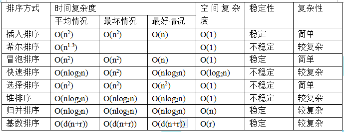

# 面试题目 第二部分 数据结构与算法

GitHub : <a href="https://github.com/ProgramCZ">ProgramCZ</a> | WeChat OA : ProgramCZ

## 快速索引

| 第一节                                        | 第二节                                        | 第三节                            | 第四节                                    |
| --------------------------------------------- | --------------------------------------------- | --------------------------------- | ----------------------------------------- |
| [数据结构 > 哈希表](#第一节-数据结构--哈希表) | [数据结构 > 二叉树](#第二节-数据结构--二叉树) | [算法 > 排序](#第三节-算法--排序) | [算法 > 动态规划](#第四节-算法--动态规划) |

## 第一节 数据结构 > 哈希表

### #00 什么是哈希表？如何处理冲突？

哈希表又名散列表，是根据关键字直接寻找数据的存储位置，不需要进行比较，查找效率较高。

在构建哈希表中，最关键的就是哈希函数的设计，一般有六种方法：

- 直接定址法：哈希函数为一次函数；
- 数字分析法：如果关键字由多个字符或数字组成，可以考虑抽取其中的若干位作为哈希地址；
- 平方取中法：对关键字做平方操作，取中间的若干位作为哈希地址；
- 折叠法：将关键字分割为位数相同的几部分，取这几部分的叠加和（舍去进位）作为哈希地址；
- 除留余数法：若已知整个哈希表的最大长度`m`，则可以取一个不大于`m`的数`p`，对关键字进行取余运算，将运算结果作为哈希地址；
- 随机数法：取关键字的一个随机函数值作为哈希地址；

处理冲突的方法：

- 开放定址法：包含线性探测法、二次探测法、伪随机数探测法，即

  ```
  H(key)=(H(key) + d) MOD m
  ```

  其中`d`就是用上面三种方法确定的增量，分别为

  - 线性探测法：`d = 1, 2, 3, ..., m-1`，可以理解为一直向右寻找，子弹式；
  - 二次探测法：`d = 12, -12, 22, -22, 32`，可以理解为一直向左/右寻找，涟漪式；
  - 伪随机数探测法；

- 再哈希法：使用另一个哈希函数计算，直到冲突不再发生；

- 链地址法：将所有发生冲突的关键字所对应的数据全部存储在同一个线性链表中；

- 公共溢出区。

## 第二节 数据结构 > 二叉树

### #00 常见的树结构有哪些？

- 二叉树：对于一棵树，任意节点最多包含两个子树；
- 满二叉树：对于一棵二叉树，每一层的节点数目都是最大值；
  - 深度为$k$的满二叉树必然包含$2^k-1$个节点；
  - 包含$n$个节点的满二叉树的深度为$log_2(n+1)$；
- 完全二叉树：对于一棵二叉树，最后一层的节点从左到右连续且紧密地排列，其他各层的节点数目都是最大值；
  - 包含$n$个节点的完全二叉树的深度为$floor(log_2n)+1$；
- 平衡二叉树：对于一棵二叉树，任意节点的两棵子树的深度差不大于1；
- 二叉搜索树：对于一棵二叉树，任意节点的非空左子树的所有结点都小于其根节点的值，任意节点的非空右子树的所有结点都大于其根节点的值，并且其左右子树都是二叉搜索树。

### #01 如何计算二叉树的高度？

```cpp
int TreeDepth(TreeNode *root) {
    if (root == nullptr) 
        return 0;
    int nLeft = TreeDepth(root->left);
    int nRight = TreeDepth(root->right);
    return (nLeft > nRight) ? (nLeft+1) : (nRight+1);
}
```

### #02 二叉树的前序遍历、中序遍历、后序遍历使用递归和非递归的方法应该怎么实现？

- 递归方法：

  ```cpp
  void Order(TreeNode *root, vector<int> &path) {
      if (root != nullptr) {
          // Pre-Order
          path.push_back(root->val);
          Order(root->left, path);
          Order(root->right, path);
          // In-Order
          Order(root->left, path);
          path.push_back(root->val);
          Order(root->right, path);
          // Post-Order
          Order(root->left, path);
          Order(root->right, path);
          path.push_back(root->val);
      }
  }
  ```

- 非递归方法：

  ```cpp
  void Order(TreeNode *root, vector<int> &path) {
      stack<pair<TreeNode *, bool>> s;
      s.push(make_pair(root, false));
      bool visited;
      while (!s.empty()) {
          root = s.top().first;
          visited = s.top().second;
          s.pop();
          if (visited)
              path.push_back(root->val);
          else {
              // Pre-Order
              s.push(make_pair(root->right, false));
              s.push(make_pair(root->left, false));
              s.push(make_pair(root, true));
              // In-Order
              s.push(make_pair(root->right, false));
              s.push(make_pair(root, true));
              s.push(make_pair(root->left, false));
              // Post-Order
              s.push(make_pair(root, true));
              s.push(make_pair(root->right, false));
              s.push(make_pair(root->left, false));
          }
      }
  }
  ```

## 第三节 算法 > 排序

### #00 各类排序算法的平均时间复杂度、最坏时间复杂度、最好时间复杂度、空间复杂度分别是多少？



## 第四节 算法 > 动态规划

### #00 如何使用动态规划算法求解0-1背包问题？

问题描述：现有$n$个物品，第$i$个物品的重量为$w_i$，价值为$v_i$，需要选择若干物品装入容量为$W$的背包中。在这种情况下，如何选择装入背包的物品，使得其总价值最大？

输入样例：5个物品，重量分别为3、4、7、8、9，价格分别为4、5、10、11、13，背包容量为17；

输出样例：总价值最大为24。

```cpp
int knap_sack(int capacity, const vector<int> &weights, const vector<int> &values) {
    int n = weights.size();
    vector<vector<int>> dp(n, vector<int>(capacity+1));
    dp[0][0] = 0;
    // dp[i][j]表示对于前i个物体来说，在背包容量为j的情况下，总价值的最大值
    for (int i = 1; i <= weights.size()-1; ++i) {
        for (int j = 1; j <= capacity; ++j) {
            // 如果第i个物体的重量大于背包容量，则可以直接用第i-1个物体的结果
            // 否则，我们可以判断一下“放入第i个物体”与“不放入第i个物体”两种情况中的较大值
            // 特别地，对于“放入第i个物体”，背包剩下的空间就是j-weights[i]
            // 这块空间的最大价值恰好就是dp[i-1][j-weights[i]]
            if (weights[i] > j) {
                dp[i][j] = dp[i-1][j];
            } else {
                int v1 = dp[i-1][j-weights[i]] + values[i];
                int v2 = dp[i-1][j];
                dp[i][j] = max(v1, v2);
            }
        }
    }
    return dp[n-1][capacity];
}

int main() {
    int capacity = 17;
    vector<int> weights = {0, 3, 4, 7, 8, 9};
    vector<int> values = {0, 4, 5, 10, 11, 13};
    
    int res = knap_sack(capacity, weights, values);
    cout << res << endl;

    return 0;
}
```