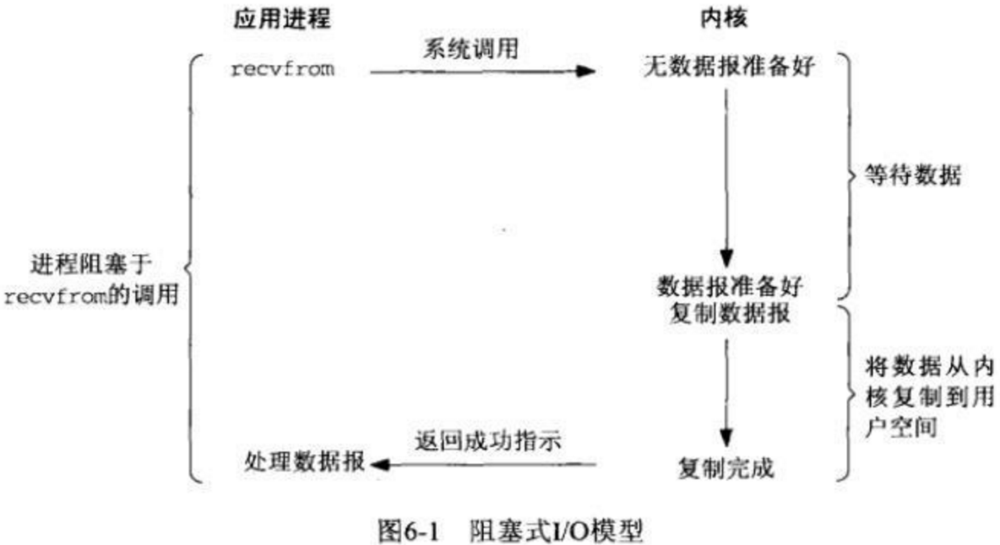
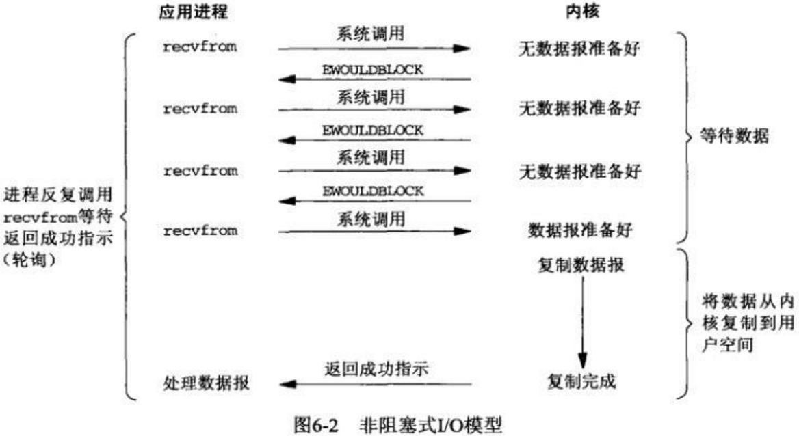
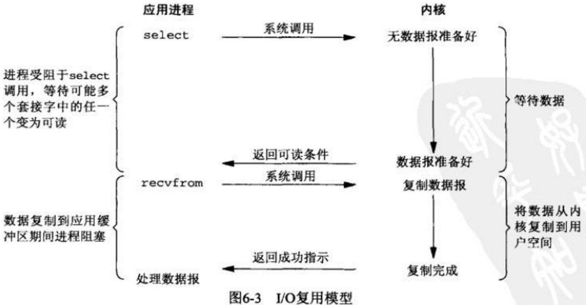
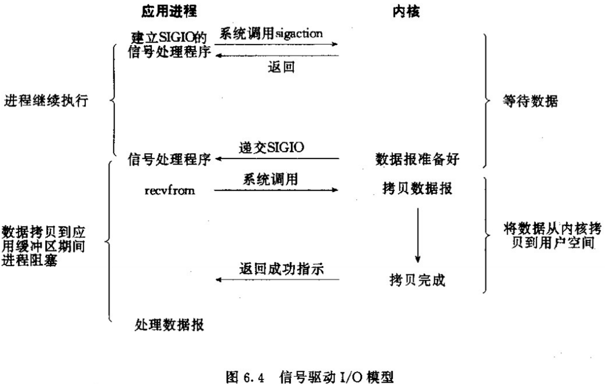
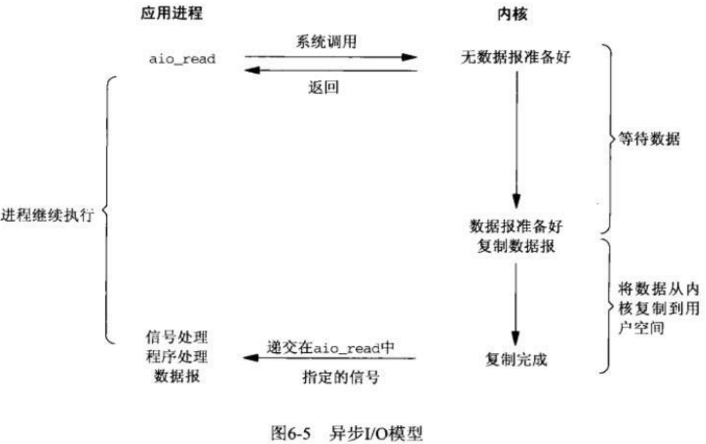

# 面试题目 第三部分 Linux操作系统

GitHub : <a href="https://github.com/ProgramCZ">ProgramCZ</a> | WeChat OA : ProgramCZ

## 快速索引

| 第一节                               | 第二节                           | 第三节                    |
| ------------------------------------ | -------------------------------- | ------------------------- |
| [操作系统基础](#第一节-操作系统基础) | [进程和线程](#第二节-进程和线程) | [I/O模型](#第三节-IO模型) |

## 第一节 操作系统基础

### #00 什么是大端和小端？如何判断一个系统是大端还是小端？

大端就是高位字节存放在内存的低地址段，低位字节存放在内存的高地址段；

小端就是低位字节存放在内存的低地址段，高位字节存放在内存的高地址段；

判断方法：

```cpp
union {
    short val;
    char c[sizeof(short)];
} test;
test.val = 0x0102;
if (test.c[0] == 0x01 && test.c[1] == 0x02)
    cout << "big endian" << endl;
else
    cout << "little endian" << endl;
```

### #01 处理器的状态可以分为哪几种？

- 内核态，运行于进程上下文，内核代表进程运行于内核空间；
- 内核态，运行于中断上下文，内核代表硬件运行于内核空间；
- 用户态，运行于用户空间。

### #02 并行和并发有什么区别？

- 并行是指在同一时刻，有多条指令在多个处理器上同时执行，无论从微观还是宏观上来看，都是多个独立任务同时执行，适用于资源充足的情况，如多核；
- 并发是指在同一时刻只能有一条指令执行，但多个指令被快速地轮换执行，使得从微观来看不是多个独立任务同时执行，但从宏观来看是同时执行，适用于资源有限的情况，如单核。

### #03 程序编译的顺序是什么？

1. 预处理：源代码经过预处理器，生成一个`.i`中间文件，这个阶段会把`#include`的头文件内容进行替换，并处理宏定义；
2. 编译：`.i`中间文件生成`.s`汇编文件；
3. 汇编：`.s`汇编文件经过汇编器生成`.obj`目标文件；
4. 链接：`.obj`目标文件经过链接器，与`lib`静态链接库和`dll`动态链接库生成可执行文件。

## 第二节 进程和线程

### #00 进程和线程有什么区别？

- 进程是资源分配的最小单位，拥有独立的地址空间，每启动一个进程，系统都会建立数据表来维护其代码段、堆栈段和数据段；创建和切换进程的开销较大；进程间通信较复杂；多进程程序更加安全，进程间互不影响。
- 线程是程序执行的最小单位，没有独立的地址空间；创建和切换线程的开销较小；线程间通信较方便；多线程程序不易维护，线程间相互影响。

### #01 多进程和多线程有什么区别？

类似问题：[#03 进程和线程有什么区别？](# #03 进程和线程有什么区别？)

- 多进程中数据是分离的，这样共享复杂，同步简单；而多线程中数据是共享的，这样共享简单，同步复杂；
- 进程创建、销毁和切换比较复杂，速度较慢；线程创建、销毁和切换比较简单，速度较快；
- 进程占用内存多，CPU利用率低；线程占用内存少，CPU利用率高；
- 多进程的编程和调试比较简单，多线程的编程和调试比较复杂；
- 进程间不会相互影响；而一个线程挂掉将导致整个进程挂掉；
- 多进程适用于多核、多机分布；多线程适用于多核分布。

### #02 多进程和多线程之间如何选择？

- 使用多进程的场景：弱相关的任务、需要拓展到多机分布的任务；
- 使用多线程的场景：需要频繁创建和销毁的任务(如Web服务器)、需要进行大量计算的任务、强相关的任务、需要拓展到多核分布的任务。

### #03 进程的组成部分有哪些？

进程通常由进程控制块和相应的地址空间组成；

Linux环境下，进程控制块主要包含：

- 进程标识符(即进程ID)；
- 进程的当前状态；
- 相应的进程控制信息；

地址空间又可以分为：

- 文本段：存放相应的程序代码；
- 用户数据段：存放相应的程序处理数据；
- 系统数据段：存放相应的程序运行环境。

### #04 进程的基本状态有哪些？

创建、就绪、执行、等待和终止。

### #05 进程间的通信方式有哪些？

- 匿名管道`pipe`：半双工的通信方式，数据只能单向流动，且只能在有亲缘关系的进程间使用；
- 有名管道`named pipe`：与`pipe`相似，但允许在无亲缘关系的进程间使用；
- 消息队列`message queue`：消息链表，存放在内核中并由消息队列标识符进行标识，克服了信号传递信息少、管道只能承载无格式字节流以及缓冲区大小受限等缺点；
- 共享存储`shared memory`：映射一段能够被其他进程访问的内存，一般与信号量配合使用；
- 信号量`semophore`：计数器，用来控制多个进程对共享资源的访问，常常作为锁机制，用于不同进程间或同一进程内不同线程间的同步；
- 套接字`socket`：可用于不同机器间的进程通信；
- 信号`signal`：比较复杂，用于通知进程某个事件已经发生。

### #06 进程的上下文可以分为哪几个部分？

- 用户级上下文：正文、数据、用户堆栈以及共享存储区；
- 寄存器上下文：通用寄存器、程序寄存器(IP)、处理器状态寄存器(EFLAGS)、栈指针(ESP)；
- 系统级上下文：进程控制块(task_struct)、内存管理信息(mm_struct、vm_area_struct、pgd、pte)、内核栈。

### #07 什么是进程切换/上下文切换？

进程切换即上下文切换，是指处理器从一个进程切换到另一个进程，内核在处理器上对于进程进行以下操作：

1. 挂起一个进程，将这个进程在处理器中的状态（即上下文）存储于内存中；
2. 在内存中检索下一个进程的上下文，并将其在CPU的寄存器中恢复；
3. 跳转到程序计数器所指向的位置（即跳转到进程被中断时的代码行），以恢复该进程。

### #08 进程调度算法有哪几种？

- 先来先服务(FCFS)：有利于长进程、CPU繁忙的进程，不利于短进程、I/O繁忙的进程；
- 短作业优先(SJF)：对预计执行时间短的进程优先分派处理机，通常后来的短进程不抢先正在执行的进程；相比于FCFS算法，SJF可以改善平均周转时间和平均带权周转时间，缩短进程的等待时间，提高系统的吞吐量，但是不利于长进程，而且未能根据进程的紧迫程度来划分优先级，以及难以准确估计进程的执行时间，从而影响性能；
- 最高响应比优先(HRRN)：FCFS只考虑等待时间，SJF只考虑执行时间，而HRRN同时考虑每个作业的等待时间和执行时间，定义响应比$R=(W+T)=1+W/T$，其中$W$为等待时间，$T$为执行时间；由于每次调度前都要计算响应比，系统开销相应增加；
- 时间片轮转(RR)：使得进程以FCFS的方式按时间片轮流使用CPU，每次调度时将CPU分派给队首进程，让其执行一个时间片，其长度从几ms到几百ms，当一个时间片结束时，发生时钟中断，调度程序据此暂停当前进程的执行，将其送到就绪队列的末尾，使其出让CPU，并通过上下文切换执行当前的队首进程；不利于处理紧急作业，而且时间片的大小对系统性能的影响很大，因此时间片的大小应适当；
  - 那么应该如何确定时间片的大小？
    - 系统对响应时间的要求；
    - 就绪队列中进程的时间；
    - 系统的处理能力；
- 多级反馈队列(MFQ)：进程在不同优先级的队列间迁移，首先调度优先级高的队列中的进程，只有优先级高的队列为空时才去调度优先级低的队列中的进程；对于同一个队列中的进程，按照时间片轮转的方式进行调度，如果N个时间片后依然未能完成，则进入优先级低的队列等待；在低优先级的队列中的进程在运行时，又有新到达的作业，那么在运行完这个时间片后，CPU分配给新到达的作业，即抢占式。

### #09 什么是孤儿进程？什么是僵尸进程？僵尸进程有什么危害？如何解决？

- 孤儿进程：一个父进程退出，而它的一个或多个子进程还在运行，那么这些子进程将成为孤儿进程，将被`init`进程（进程号为1）所收养，并由`init`进程对这些子进程完成状态收集工作；

- 僵尸进程：一个进程使用`fork`创建子进程，如果子进程退出，而父进程并未调用`wait`或`waitpid`来获取子进程的状态信息，子进程的进程描述符仍然保存在系统中，那么这种子进程将成为僵尸进程。

  僵尸进程的危害：在子进程退出的时候，内核释放该子进程所有的资源，但仍保留进程号、退出状态、运行时间等信息，直到父进程通过`wait`或`waitpid`对其进行释放；但如果父进程不对保留信息进行释放，进程号会一直被占用，然而系统所能使用的进程号是有限的，如果产生大量的僵尸进程，系统将因没有可用的进程号而导致系统不能产生新的进程。

  解决僵尸进程的方法：

  - 父进程通过`wait`和`waitpid`等函数等待子进程结束，但这样会导致父进程挂起；
  - 如果父进程很忙，那么可用`signal`函数为`SIGCHLD`安装`handler`，这样当子进程结束后，父进程会收到信号，在`handler`中调用`wait`回收；
  - 如果父进程不关心子进程何时结束，那么可以用`signal(SIGCHLD, SIG_IGN)`通知内核，这样当子进程结束后，内核会对其进行回收；
  - `fork`两次，父进程`fork`一个子进程后继续工作，子进程`fork`一个孙进程后退出，那么孙进程将被`init`接管，这样当子进程结束后，内核会对其进行回收。

### #10 如何使用`fork()`函数？

```cpp
pid_t pid = fork();
    switch (pid) {
        case -1:
            cerr << "Fork is failed!\n";
            break;
        case 0:
            cout << "This is child process, pid: " << getpid();
            cout << ", parent pid: " << getppid() << endl;
            break;
        default:
            cout << "This is parent process, pid: " << getpid();
            cout<< ", child pid: " << pid << endl;
    }
```

`fork()`函数创建的子进程会完全复制父进程的资源，代码也不例外，但是`fork()`函数在父进程中返回的是子进程的`pid`，如果为`-1`则说明创建子进程失败；在子进程中返回的是`0`，可以借此区分父进程和子进程。

### #11 线程同步的方法有哪些？

- 临界区：串行化访问公共资源或代码段，速度较快；
- 互斥量：采用互斥对象机制，只有拥有互斥对象的线程才能访问公共资源，而因为互斥对象只有一个，所以可以保证公共资源不会被多个线程同时访问；
- 信号量：允许多个线程在同一时刻访问同一公共资源，但限制同一时刻访问该公共资源的最大线程数量；
- 事件：使用通知操作的方式，可以方便地实现多线程优先级的比较操作。

### #12 什么是临界区？进程进入临界区的调度原则是什么？

临界区是一段针对共享资源的保护代码，该保护代码在任意时刻只允许一个线程对共享资源访问。

线程进入临界区的调度原则是：

1. 如果有若干进程要求进入空闲的临界区，则每次只允许一个进程进入；
2. 任何时候，处于临界区内的进程不可多于一个；
3. 进入临界区的进程要在有限时间内退出，以便其他进程能及时进入临界区；
4. 如果进程不能进入临界区，则应让出CPU，避免进程出现忙等现象。

### #13 线程创建的方式有哪几种？

1. 使用初始函数创建线程；
2. 使用类对象创建线程；
3. 使用lambda匿名函数创建线程。

### #14 为什么需要使用线程池？

- 过于频繁地创建或销毁线程会带来大量系统开销，影响处理效率；
- 线程并发数量过多，抢占系统资源从而导致阻塞；
- 可以对线程进行一些简单的管理，如延时执行、定时循环执行。

### #15 哪些资源是线程共享的？哪些资源是线程私有的？

- 线程共享：进程代码段、进程的公有数据、进程打开的文件描述符、信号的处理器、进程的当前目录和进程用户ID与进程组ID；
- 线程私有：线程ID、寄存器里的值、栈、线程的私有数据、线程的优先级、信号屏蔽码、错误返回码。

### #16 多线程锁的种类有哪些？

互斥锁、递归锁、自旋锁、读写锁。

### #17 什么是死锁？死锁产生的原因是什么？死锁有哪些必要条件？

死锁是指多个进程因竞争资源而造成的一种僵局（互相等待），若无外力作用，则这些进程都将无法向前推进。

死锁产生的原因：系统资源竞争、线程运行推进顺序不当。

死锁的四个必要条件：

1. 互斥条件：在一段时间内某资源只能被一个进程使用，如果有其他进程请求该资源，则请求进程只能等待；
2. 请求与保持条件：进程已经保持了至少一个资源，但又提出新的资源请求，而该资源已被其他进程占用，此时请求进程被阻塞，对自己已有资源保持不放；
3. 不可剥夺条件：进程所获得的资源在未使用完毕时，不能被其他进程强行夺走，即只能由获得该资源的进程主动释放；
4. 循环等待条件：若干进程间形成首尾相接、循环等待资源的关系。

### #18 如何预防死锁？如何避免死锁？如何检测死锁？如何解除死锁？

预防死锁的方法：核心思想是破坏死锁的四个必要条件之一，即

- 破坏请求与保持条件：采用预先静态分配的方法，即进程在运行前一次申请完它所需要的全部资源，在未满足全部资源时不运行；但系统资源被严重浪费，且易导致“饥饿”状态；
- 破坏不可剥夺条件：当一个进程请求新的资源但未满足时，该进程必须释放已经保持的所有资源，以后需要时再重新申请；但反复地申请和释放资源会增加系统开销，降低系统吞吐量；
- 破坏循环等待条件：采用顺序资源分配法，即给系统中的资源编号，规定每个进程必须按照编号顺序申请资源；但限制了新类型设备的增加。

避免死锁的方法：

- 进程启动拒绝：如果一个进程的请求会导致死锁，则不执行该进程；
- 资源分配拒绝：又名银行家算法，如果一个进程增加的资源请求会导致死锁，则不允许分配。

检测死锁的方法：

- 为每个进程和每个资源制定唯一编号；
- 设定一张资源分配表，记录各进程与占用资源之间的对应关系；
- 设定一张进程等待表，记录各进程与申请资源之间的对应关系；
- 判断是否出现环路，是则引发死锁。

解除死锁的方法：

- 资源剥夺法：挂起某些死锁进程，并释放其所保持的资源，分配给其他死锁进程，但应防止被挂起的进程长时间得不到资源，而处于资源匮乏的状态；
- 撤销进程法：强制撤销部分、甚至全部死锁进程，并释放其所保持的资源；撤销顺序可以按照进程优先级和撤销进程代价的高低来进行；
- 进程回退法：让某些死锁进行回退到足以回避死锁的地步，回退过程中自愿释放自愿，但要求系统保留进程历史信息，设置还原点。

### #19 如何使用单线程处理高并发？

在单线程模型中，采用多路复用I/O来提高单线程处理多个请求的能力，然后采用事件驱动模型，基于异步回调来处理事件。

## 第三节 I/O模型

### #00 同步和异步有什么区别？

- 同步是指在发起一个调用之后，调用者需要一直等待调用结果的通知，才能进行后续的操作；
- 异步是指在发起一个调用之后，调用者不能立即得到调用结果的返回，需要被调用者通过状态、通知和回调来通知调用者。

需要注意的是，同步/异步强调的是消息通信机制。

### #01 阻塞和非阻塞有什么区别？

- 阻塞是指在发起一个调用之后，在消息返回之前，当前进程/线程会被挂起，直到有消息返回，当前进程/线程才会被激活；
- 非阻塞是指在发起一个调用之后，不会阻塞当前进程/线程，而会立即返回。

需要注意的是，阻塞/非阻塞强调的是等待消息时的状态。

### #02 Linux的I/O模型包含哪五种？各自有什么特点？

- 同步I/O

  - 阻塞I/O：进程保持阻塞状态，直到数据拷贝完成；

    

  - 非阻塞I/O：轮询检查内核数据，直到数据准备好，再拷贝数据到进程，进行数据处理；需要注意的是，拷贝数据的过程中，进程依然是阻塞装填；

    

  - 多路复用I/O：进程调用`select`、`poll`、`epoll`函数，保持阻塞状态，但与阻塞I/O不同的是，这些函数可以同时处理多个I/O；

    

  - 信号驱动I/O：首先建立一个信号处理函数，进程继续运行并不阻塞，当数据准备好时，进程会收到一个`SIGIO`信号，可以在信号处理函数中处理数据；

    

- 异步I/O：在发起一个调用之后，调用者不能立即得到调用结果的返回，需要被调用者通过状态、通知和回调来通知调用者。

  

这五种模型的比较如下图所示：


### #03 `select`、`poll`、`epoll`之间有什么区别？

- `select`本质上是通过设置和轮询`fd_set`来检查是否有就绪的文件描述符，其缺点在于：

  - 单个进程可监视的文件描述符数量较少，在32位机器上默认为1024个，在64位机器上默认为2048个；
  - 每次调用`select`都需要把`fd_set`从用户空间拷贝到内核空间，文件描述符较多时开销较大；
  - 每次调用`select`都需要线性扫描`fd_set`，文件描述符较多时开销较大。

- `poll`与`select`相似，不同之处在于`poll`使用`pollfd`链表结构保存文件描述符，因此与`select`相比，没有文件描述符数量的限制。

- `epoll`提供了三个函数：

  - `epoll_create`用于创建一个`epoll`句柄；
  - `epoll_ctl`用于注册要监听的事件类型，其特点是：
    - 每次注册新的事件到`epoll`句柄中时，会把所有的文件描述符拷贝进内核空间，保证了每个文件描述符在整个过程中只拷贝一次，不会出现重复拷贝；
    - 为每个文件描述符指定一个回调函数，当事件发生时，就会调用这个回调函数，把就绪的文件描述符加入到就绪链表中；
  - `epoll_wait`用于等待事件的发生，唤醒等待中的进程；

  `epoll`对文件描述符的操作有两种模式：

  - 水平触发：当`epoll_wait`检测到描述符事件发生并将此事件通知应用程序，应用程序可以不立即处理该事件，下次调用`epoll_wait`时，将会再次响应应用程序并通知此事件；
  - 边缘触发：当`epoll_wait`检测到描述符事件发生并将此事件通知应用程序，应用程序必须立即处理该事件，如果不处理，下次调用`epoll_wait`时，不会再次响应应用程序并通知此事件；

需要注意的是，表面上看`epoll`的性能最好，但是连接数量较少并且都十分活跃的情况下，`select`和`poll`的性能可能较好，因为`epoll`的通知机制需要使用回调函数。
