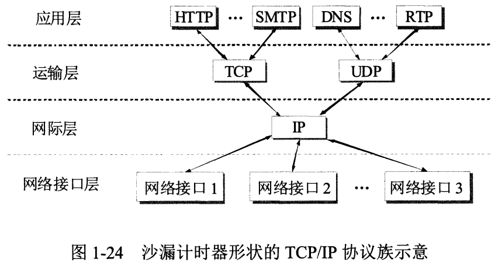
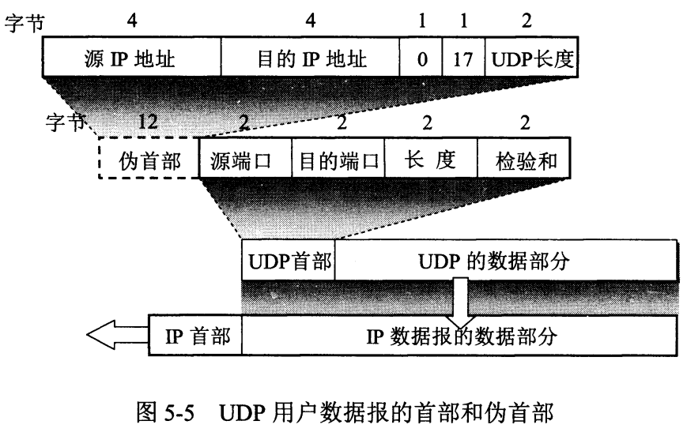
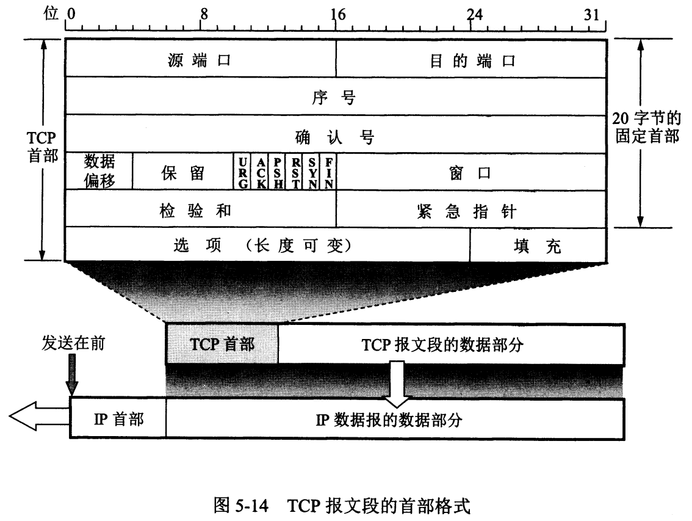
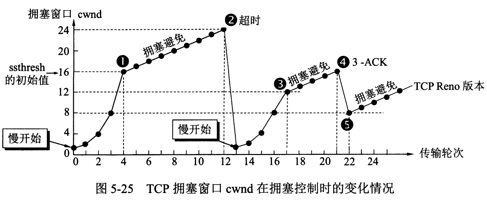
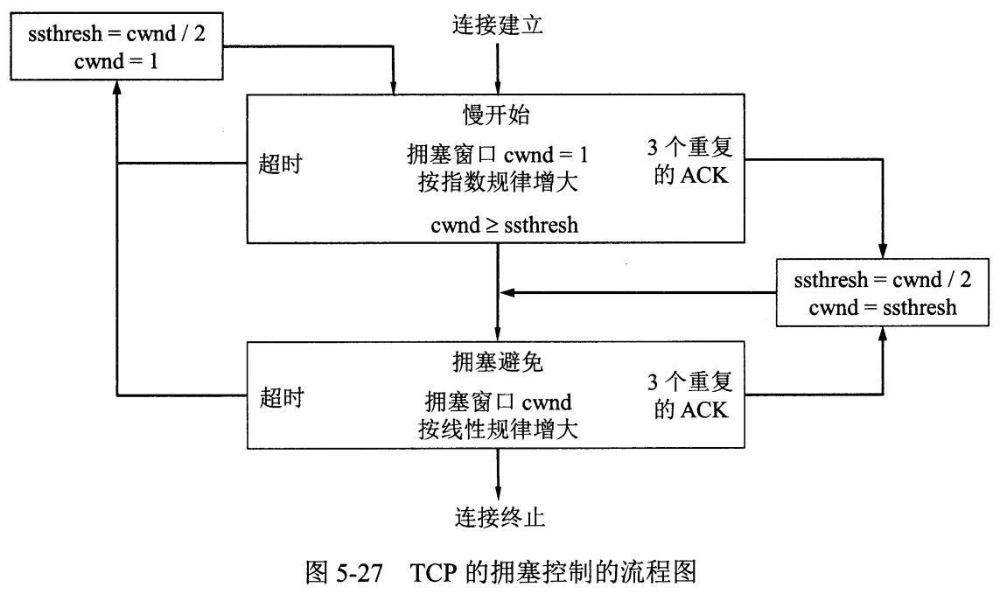
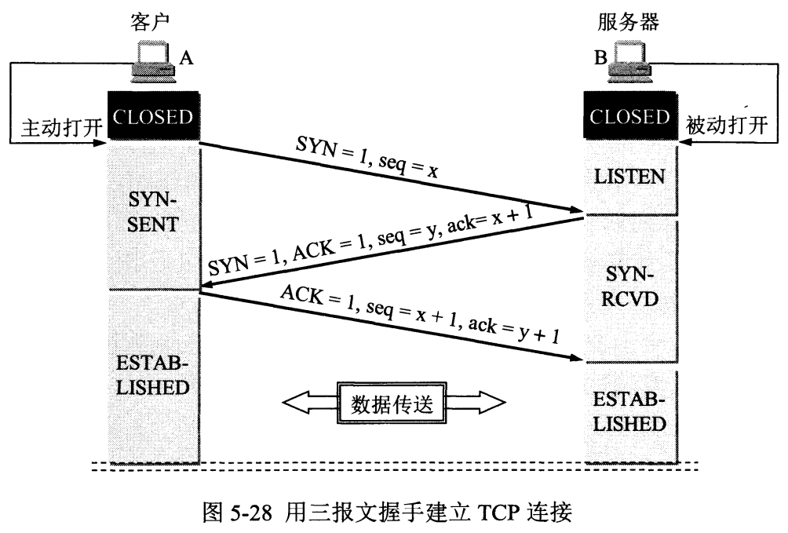
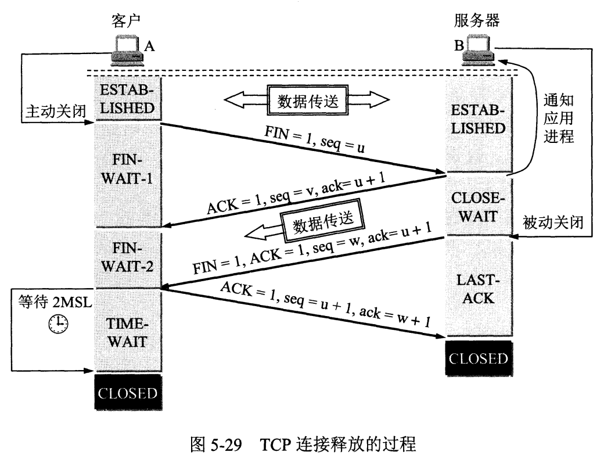

# 面试题目 第四部分 计算机网络

GitHub : <a href="https://github.com/ProgramCZ">ProgramCZ</a> | WeChat OA : ProgramCZ

## 快速索引

| 第一节                        | 第二节                                              | 第三节                                          | 第四节                        |
| ----------------------------- | --------------------------------------------------- | ----------------------------------------------- | ----------------------------- |
| [网络基础](#第一节-网络基础) | [传输层 > TCP/IP协议](#第二节-传输层--TCPIP协议) | [应用层 > HTTP协议](#第三节-应用层--HTTP协议) | [网络编程](#第四节-网络编程) |

## 第一节 网络基础

### #00 OSI的七层网络模型包含哪些层？

应用层、表示层、会话层、传输层、网络层、数据链路层、物理层。

### #01 TCP/IP的四层网络模型包含哪些层？

应用层(对应OSI的应用层、表示层、会话层)、运输层、网际层(对应OSI的网络层)、网络接口层(对应OSI的数据链路层、物理层)。

## 第二节 传输层 > TCP/IP协议

### #00 UDP协议的主要特点有哪些？

1. UDP是无连接的运输层协议；
2. UDP支持一对一、一对多、多对一和多对多的交互通信；
3. UDP使用尽最大努力交付，即不提供可靠交付的服务；
4. UDP面向报文，将应用程序交下来的数据，既不合并也不拆分，保留报文的边界，添加首部后就向下交付到IP层；因此，应用程序必须选择合适大小的报文。
5. UDP的首部开销较小，只有8个字节，相比于TCP的首部有至少20个字节。

### #01 UDP报文段的首部格式是什么？

各字段的意义如下：

1. 源端口：在需要对方回信时选用；
2. 目的端口：在终点交付报文时使用；
3. 长度：UDP用户数据报的长度；
4. 检验和：检测UDP用户数据报在传输中是否有错，有错则丢弃。

### #02 UDP如何计算检验和？

- 在计算检验和时，需要在UDP用户数据报之前增加12个字节的伪首部，不向下传送也不向上递交，仅用于计算校验和；
- 在发送方，把全零放入检验和字段，再把伪首部和UDP用户数据报看成是由许多16位字，使用全零补齐字节后，按照二进制反码计算这些16位字的和，将此和的二进制反码写入校验和字段，然后发送；
- 在接收方，把伪首部、收到的UDP用户数据报以及可能的补齐字节后，按照二进制反码求这些16位字的和，无差错时其结果应为全1，否则出现差错。

### #03 TCP协议的主要特点有哪些？

1. TCP是面向连接的运输层协议；

2. 每一条TCP连接只能有两个端点，只能是点对点、一对一的；

   此处的端点是指套接字(socket)或插口，而根据RFC 793的定义，端口号拼接到IP地址即构成套接字；

3. TCP提供全双工通信，连接的两端都可以临时存放双向通信的数据；

4. TCP提供可靠交付的服务，传送的数据保证无差错、不丢失、不重复，并且按序到达；

5. TCP面向字节流，将应用程序交下来的数据仅看成是一连串无结构的字节流，写入缓存后根据对方的窗口值和当前网络拥塞的程度来决定一个报文段应该包含多少个字节。

### #04 TCP报文段的首部格式是什么？

TCP报文段首部的前20个字节是固定的，后面有$4n$个字节是根据需要而增加的选项；

首部固定部分各字段的意义如下：

1. 源端口和目的端口：各占2个字节；

2. 序号：占4个字节，在TCP连接中的每一个字节都会按顺序进行编号，而该字段是指本报文段所发送的数据的第一个字节的序号；

3. 确认号：占4个字节，是指期望收到对方下一个报文段的第一个数据字节的序号；

4. 数据偏移：占1个字节，是指TCP报文段的首部长度，因为首部中还有长度不确定的选项字段；

5. 保留：占6位，保留为今后使用；

   接下来的6个控制位，用于说明本报文段的性质：

6. 紧急`URG`：当`URG=1`时，表明紧急指针字段有效，告诉系统应尽快传送该报文段，配合紧急指针字段使用；

7. 确认`ACK`：当`ACK=1`时，表明确认号字段有效，在连接建立后所有传送的报文段都必须把`ACK`置`1`；

8. 推送`PSH`：当两个应用进程进行交互时通信时，有时在一端的应用进程希望在键入一个命令后立即就能够收到对方的相应，此时可以使用推送操作；

   紧急`URG`和推送`PSH`之间的区别：`URG=1`时，紧急数据不进入接收缓存，直接交付给应用进程，剩下的数据进入接收缓存；`PSH=1`时，不用等到整个接收缓存填满，而是可以直接交付，但注意这里的交付还是从缓存中交付的；

9. 复位`RST`：当`RST=1`时，表明TCP连接中出现严重差错，必须释放连接再重新建立连接；还可以用于拒绝一个非法的报文段或拒绝打开一个连接；

10. 同步`SYN`：用于在连接时同步序号；当`SYN=1`而`ACK=0`时，表明这是一个连接请求报文段，对方若同意建立连接，则应在响应的报文段中使`SYN=1`和`ACK=1`；

11. 终止`FIN`：用于释放一个连接；当`FIN=1`时，表明此报文段的发送方的数据已发送完毕，要求释放连接。

12. 窗口：占2个字节，是指发送本报文段的一方的接收窗口，表明从本报文段首部中的确认号算起，接收方目前允许对方发送的数据量；

13. 检验和：占2个字节，检验和字段检验的范围包括首部和数据两部分；计算校验和时，需要在TCP报文段前面加上12个字节的伪首部，接收方收到此报文段后，仍要加上这个伪首部来计算校验和；

14. 紧急指针：占2个字节，仅在`URG=1`时才有意义；值得注意的是，即使窗口为零时也可发送紧急数据；

15. 选项：长度可变，最长可达40个字节；可以用于存放最大报文段长度MSS，即TCP报文段长度减去TCP首部长度。

### #05 TCP的发送缓存和接收缓存分别用于存放什么？

发送缓存用于存放：

- 发送应用程序传送给发送方TCP准备发送的数据；
- 已发送出但尚未收到确认的数据。

接收缓存用于存放：

- 按序到达的但尚未被接收应用程序读取的数据；
- 未按序到达的数据。

### #06 TCP接收方为什么必须有累计确认的功能？

累计确认的功能可以减少传输开销，接收方可以在合适的时候发送确认，接收方不应过分推迟发送确认，否则会导致发送方不必要的重传，这反而浪费了网络资源；TCP标准规定，确认推迟的时间不应超过0.5秒，若收到一连串具有最大长度的报文段，则必须每隔一个报文段就发送一个确认。

### #07 TCP超时重传时间应该如何选择？

TCP采用了一种自适应算法，记录一个报文段发送的时间，以及收到相应确认的时间，这两个时间之差就是报文段的往返时间RTT。TCP保留了加权平均往返时间RTTs，按照下式进行计算：
$$
新的RTT_S=(1-\alpha)*(旧的RTT_S)+\alpha*(新的RTT)
$$
RFC 6298推荐$\alpha=1/8$，且超时重传时间RTO应略大于RTTs，按照下式进行计算：
$$
RTO=RTT_S+4*RTT_D
$$
其中，$RTT_D$是RTT的偏差的加权平均值，第一次测量时取为RTT样本值的一般，之后按照下式进行计算：
$$
新的RTT_D=(1-\beta)*(旧的RTT_D)+\beta*(RTT_S-新的RTT)
$$
RFC 6298推荐$\beta=1/4$。

但是出现的问题：在发生重传之后，如何判定返回的确认报文段是对先发送的报文段的确认，还是对后来重传的报文段的确认？

想要解决这个问题，可以：报文段每次重传一次，就把超时重传时间RTO增大为原来的2倍，当不再发生报文段的重传时，才根据公式计算超时重传时间。

### #08 TCP如何实现流量控制？

TCP通过滑动窗口实现流量控制，即发送方的发送窗口不能超过接收方给出的接收窗口的数值，使得发送方的发送速率不要太快，要让接收方来得及接收。

但是出现的问题：接收方向发送方发送了零窗口的报文段后不久，接收方的接收缓存又有了一些存储空间，于是向发送方返回非零窗口的报文段，但这个报文段在传送过程中丢失了，双方都在等待，形成死锁，如何解决？

想要解决这个问题，可以：设置一个持续计时器，发送方只要收到零窗口通知，就启动持续计时器；若持续计时器设置的时间到期，就发送一个零窗口探测的报文段，仅携带1字节的数据，而接收方就在确认这个探测报文段时给出了现在的窗口值；如果此时窗口依然是零，那么发送方重置持续计时器。

### #09 TCP如何实现拥塞控制？

TCP进行拥塞控制的算法共有四种：慢开始、拥塞避免、快重传、快恢复。

发送方维持拥塞窗口的原则是：只要网络没有出现拥塞，拥塞窗口就可以再增大一些，以便发送更多的分组，从而提高网络利用率；但是只要网络出现拥塞或可能出现拥塞，则必须把拥塞窗口减小，以便缓解网络拥塞。

发送方判断网络拥塞的依据是：出现了超时。

注意，cwnd为拥塞窗口大小，ssthresh为慢开始门限；如果收到3个重复的ACK，说明此时发生网络丢包，而不是网络堵塞，应当立即进行重传，即快重传，但是不需要启动慢开始，而是执行快恢复算法。

### #10 TCP如何建立连接？为什么是三次握手？

1. 服务端创建传输控制块TCB，准备接收客户端的连接请求；此时，服务端进程处于`LISTEN`状态；
2. 客户端创建传输控制块TCB，向服务端发出连接请求报文段，这时首部中的同步位`SYN=1`，同时选择一个初始序号`seq=x`；`SYN`报文段不能携带数据，但需要消耗一个序号；此时，客户端进程处于`SYN-SNET`状态；
3. 服务端收到连接请求报文段后，如果同意建立连接，则向客户端发送确认报文段，这时首部中的`SYN=1`和`ACK=1`，确认号为`ack=x+1`，同时选择一个初始序号`seq=y`；同样，报文段不能携带数据，但需要消耗一个序号；此时，服务端进程处于`SYN-RCVD`状态；
4. 客户端收到确认报文段，还需要向服务端发送确认报文段，这时首部中的`ACK=1`，确认号为`ack=y+1`，而自己的序号为`seq=x+1`；此处，报文段可以携带数据，如果不携带数据则不消耗序号；此时，客户端进入`ESTABLISHED`状态；
5. 服务端收到确认报文段，也进入`ESTABLISHED`状态。

之所以需要进行三次握手，也就是客户端最后要发送一次确认报文段，主要是为了防止已失效的连接请求报文段突然传送到了服务端，因而产生错误；所谓“已失效的连接请求报文段”，是指：

1. 客户端发送一次连接请求报文段，在某些网络节点长时间滞留而未丢失，于是客户端再发送一次连接请求，成功建立连接后又成功释放连接；
2. 此时第一个连接请求终于到达，服务端误认为这是客户端新的连接请求，于是就向客户端发送确认报文段，同意建立连接；
3. 此时如果不采用第三次握手，那么只要服务端发出确认请求，新的连接就建立了，但由于客户端实际上并没有发出新的连接请求，自然不会理睬，而服务端一直等待客户端发送数据，造成资源浪费。

### #11 TCP如何释放连接？

1. 客户端处于`ESTABLISHED`状态，客户端向服务端发送连接释放报文段，并停止发送数据，主动关闭连接；报文段首部的终止控制位`FIN=1`，其序号`seq=u`，等于已传送过的数据的最后一个字节的序号加`1`；此时，客户端进入`FIN-WAIT-1`状态，等待服务端的确认；报文段即使不携带数据，也消耗一个序号；

2. 服务端处于`ESTABLISHED`状态，收到连接释放报文段后即发送确认报文段，确认号为`ack=u+1`，而这个报文段自己的序号为`seq=v`，等于已传送过的数据的最后一个字节的序号加`1`；此时，服务端进入`CLOSE-WAIT`状态，但服务端还有数据需要发送，所以此时TCP连接处于半关闭状态；

3. 客户端收到确认报文段，进入`FIN-WAIT-2`状态；

4. 如果服务端已经没有要向A发送的数据，则服务端发送连接释放报文段，`FIN=1`，确认号为`ack=u+1`，自己的序号为`seq=w`；此时，服务端进入`LAST-ACK`状态；

5. 客户端收到连接释放报文段后，发送确认报文段，确认号为`ack=w+1`，自己的序号为`seq=u+1`；此时，客户端进入`TIME-WAIT`状态，经过2MSL后，进入`CLOSED`状态；其中，MSL叫做最长报文段寿命；

   之所以需要等待2MSL的时间，是因为：

   - 为了保证客户端发送的最后一个确认报文段能够到达服务端，如果服务端没收到，客户端会重传；
   - 防止出现已失效的连接请求报文段，经过2MSL，可以使本连接持续的时间内所产生的所有报文段都从网络中消失，使得下一个新的连接中不会出现旧的连接请求报文段。

6. 服务端收到确认报文段，进入`CLOSED`状态。

## 第三节 应用层 > HTTP协议

### #00 什么是HTTP协议？

HTTP协议，即超文本传输协议，是一个基于请求和响应模式的、无连接无状态的应用层协议，基于TCP协议；

- 其中的无连接是指，虽然HTTP使用了面向连接的TCP，但是通信的双方在交换HTTP报文之前不需要先建立HTTP连接；
- 其中的无状态是指，同一客户端第二次访问同一服务端上的页面时，服务器的响应与第一次被访问时相同，这一特性使得服务端更容易支持大量并发的HTTP请求；

### #01 如何避免HTTP协议的无状态特性？

- 使用Cookie将状态信息保存在客户端；
- 使用Session将状态信息保存在服务端。

### #02 HTTP协议的请求报文与响应报文的格式分别是什么？

- 请求报文包含三个部分：请求行、首部行、请求内容实体主体；

  其中，请求行包含方法、请求资源的URL、HTTP版本；

- 响应报文包含三个部分：状态行、首部行、响应内容实体主体；

  其中，状态行包含HTTP版本、状态码、解释状态码的短语。

### #03 常见的HTTP方法有哪些？

- `GET`：用于请求访问已经被统一资源标识符URI识别的资源，可以通过URL传参给服务器；
- `POST`：用于传输信息给服务器，主要功能与`GET`方法类似，但一般推荐使用`POST`；
- `PUT`：传输文件，报文主题中包含文件内容，保存到对应URI位置；
- `HEAD`：获得报文首部，与`GET`方法类似，只是不返回报文主体，一般用于验证URI是否有效；
- `DELETE`：删除文件，与`PUT`方法相反，删除对应URI位置的文件；
- `OPTIONS`：查询相应URI支持的HTTP方法。

### #04 常见的HTTP状态码有哪些？

- `200`：请求被正常处理；
- `204`：请求被受理但没有资源可以返回；
- `206`：客户端只请求资源的一部分，服务端只对请求的部分资源执行`GET`方法，对应在报文中通过`Content-Range`指定范围的资源；
- `301`：永久性重定向；
- `302`：临时重定向；
- `303`：与`302`相似，区别在于客户端在请求一个URI时，能够通过`GET`方法重定向到另一个URI上；
- `304`：发送附带条件的请求时，条件不满足时返回，与重定向无关；
- `307`：与`302`相似，区别在于强制要求使用`POST`方法；
- `400`：请求报文语法有误，服务器无法识别；
- `401`：请求需要认证；
- `403`：请求的对应资源禁止被访问；
- `404`：服务器无法找到对应资源；
- `500`：服务器内部错误；
- `503`：服务器正忙。

### #05 HTTP请求包含步骤？

1. 建立客户端(浏览器)与服务端的连接；
2. 建立连接后，客户端向服务端发送一个请求；
3. 服务端收到请求，并给予响应信息；
4. 客户端将返回的内容解析并呈现，断开连接。

### #06 HTTP1.1版本有哪些新特性？

- 默认持久连接，节省通信量：只要客户端或服务端没有明确提出断开TCP连接，则一直保持连接，可以发送或响应多次HTTP请求；
- 管线化：客户端可以同时发出多个HTTP请求，而不用挨个等待响应；
- 断点续传：利用HTTP首部段，分块传输实体主体。

### #07 与HTTPS相比，HTTP有哪些缺点？HTTPS的工作原理是什么？

- HTTP的缺点：
  - 通信使用明文不加密，内容可能被窃听；
  - 不验证通信方身份，可能遭到伪装；
  - 无法验证报文完整性，可能被篡改；
- HTTPS的工作原理：
  1. 客户端使用HTTPS的URL访问服务端，要求与服务端建立SSL连接；
  2. 服务端收到客户端请求后，生成一对公钥和私钥，并把公钥放在证书中发送给客户端；
  3. 客户端根据SSL连接的安全等级，建立会话密钥，然后用公钥将会话密钥加密，传送给服务器；
  4. 服务器用自己的私钥解密出会话密钥；
  5. 服务器利用会话密钥加密与客户端之间的通信。

## 第四节 网络编程

### #00 使用Socket进行网络编程的一般步骤有哪些？

- TCP：
  - 服务端：socket -> bind -> listen -> accept -> read/write -> close
  - 客户端：socket -> connect -> write/read -> close
- UDP：
  - 服务端：socket -> bind -> read/write -> close
  - 客户端：socket -> write/read -> close